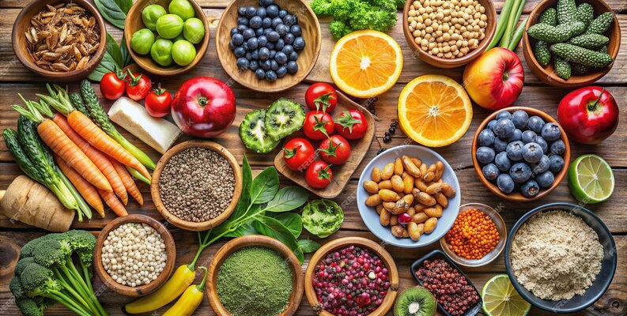
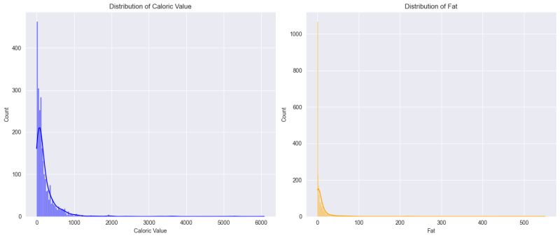
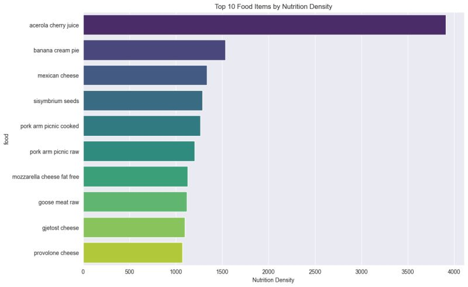
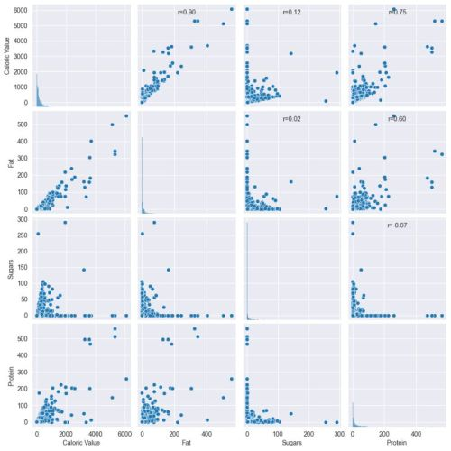

# Food Nutrition Analysis
#### Exploratory Data Analysis and Predictive Modelling of Food Nutrition Dataset

image credit: Utsav Dey

So it's been a while a played around predictive modelling so I decided to take a look at a food nutrition dataset. The dataset contains information on the nutritional content of various foods, including calories, fat, protein, and sugar. The goal of this project is to perform exploratory data analysis (EDA) to understand the distribution of nutrients in the dataset and identify any patterns or relationships between them. I will also build a predictive model to predict the calorie content of a food based on its fat, protein, and sugar content.

### Insights from EDA
**Distribution of Calorie and Fat**

The distributions of caloric value and fat content are both right-skewed, indicating that most foods in the dataset have low to moderate calorie (clustering between 0-1000 calories) and fat levels (below 100g), while a small subset of items, likely processed or energy-dense foods, contribute to the higher ranges extending to 6000 calories and 500g fat respectively. This skewness highlights the presence of outliers and suggests that using the median, rather than the mean, may better represent typical foods in the dataset

 

**Nutrition Density**

Acerola cherry juice stands out dramatically at the top with the highest nutrition density (around 3800), significantly higher than all other foods. The remaining top foods cluster between nutrition density values of 1000-2000, with banana cream pie and Mexican cheese following as distant second and third. Notably, the list includes several dairy products (Mexican cheese, mozzarella cheese fat free, gjetost cheese, provolone cheese), two variations of pork arm picnic (raw and cooked), and some unique items like sisymbrium seeds and goose meat raw. This suggests that dairy products and certain meats tend to be nutritionally dense, though the standout nutrition density of acerola cherry juice implies it's particularly rich in essential nutrients relative to its caloric content.

 

**Correlation between Nutrients**

A strongest positive correlation (r=0.90) exists between Caloric Value and Fat, indicating that higher-fat foods tend to be more caloric. There's also a moderately strong positive correlation between Caloric Value and Protein (r=0.75), suggesting that protein-rich foods generally have higher calories. Interestingly, there's virtually no correlation between Sugars and Fat (r=0.02) or Sugars and Protein (r=-0.07), implying that a food's sugar content is largely independent of its fat and protein content. The distributions along the diagonal reinforce our earlier observation of right-skewed distributions for all these nutrients, with most foods having relatively low values and a few outliers with very high content.

 

Further details such as model training can be found in the [Jupyter Notebook](https://github.com/Oyebamiji-Micheal/Food-Nutrition-Analysis/blob/main/assignment-notebook.ipynb)

### Disclaimer

This project is for educational purposes only and does not constitute professional advice. The inference and analysis presented are based entirely on the dataset and should not be used as a basis for making any decision or taking any action. I am not responsible for any errors or omissions in the content and accept no liability for any damages or losses arising from its use.
